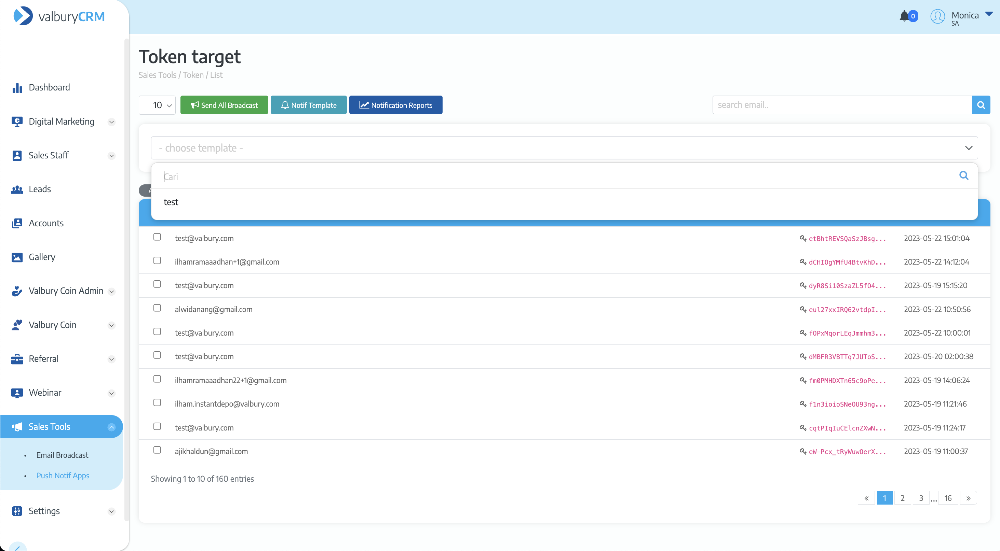

# Attachment on Leads

Sales needs to add attachment on the leads they already followed up, to add the attachment sales needs to go to detail leads and go to Documents field. Click `New Document` and upload the file.

<figure><figcaption></figcaption></figure>

<figure><figcaption></figcaption></figure>

<figure><figcaption></figcaption></figure>

To view the attachment, click on the View icon and it will open the attachment in new tab

To delete the attachment, click on the Delete icon and pop-up confirmation will appear. Click `Submit` to confirm the deletion.

<figure><figcaption></figcaption></figure>
