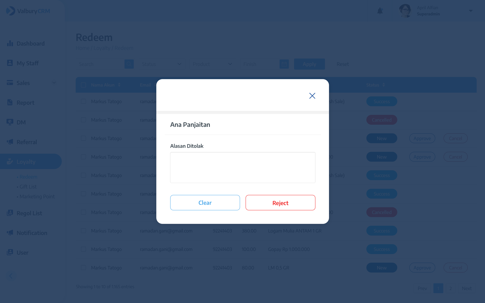

# Redeem

This page is used to view the list of marketing that already request to redeem gift, only admin can approve or reject the request.

This request have several status :&#x20;

| Status   | Description                           |
| -------- | ------------------------------------- |
| Pending  | When new request shows up on the list |
| Approved | When the request is approved by admin |
| Rejected | When the request is rejected by admin |

<figure><figcaption></figcaption></figure>

| Field     | Type   | Description                  |
| --------- | ------ | ---------------------------- |
| Nama Akun | Text   | Marketing name               |
| Email     | Text   | Marketing email              |
| No Akun   | Number | Marketing code               |
| Point     | Number | Number of points they redeem |
| Product   | Text   | Redeemed product name        |
| Status    | Text   | Status of redeem request     |

When admin click `Approve`, there will be a pop-up confirmation about approving the request. Click `Yes` to approve.

When admin click `Reject`, there will be a pop-up confirmation about rejecting the request. Input the reason and click `Reject` to confirm.

<figure><figcaption></figcaption></figure>

You can also search and filter the request by their status and the product redeemed.
